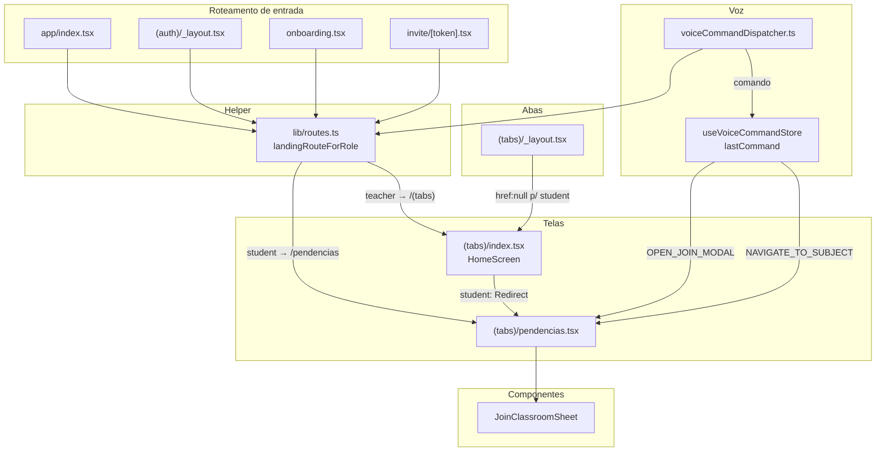

# Student Navigation Refactor — Design

**Spec**: `.specs/features/student-navigation-refactor/spec.md`
**Status**: Draft

---

## Architecture Overview

A refatoração toca quatro camadas, sem nenhuma mudança de backend:

1. **Roteamento de entrada** — os redirects que decidem onde o usuário cai
   (`index.tsx`, `(auth)/_layout.tsx`, `onboarding.tsx`, `invite/[token].tsx`)
   passam a consultar o papel via um helper único.
2. **Camada de abas** — `(tabs)/_layout.tsx` oculta a aba `index` para alunos e
   reordena para que `Pendências` seja a primeira.
3. **Camada de tela** — `pendencias.tsx` ganha o botão "+" e a folha de
   ingressar; `index.tsx` deixa de servir conteúdo de aluno.
4. **Camada de voz** — `voiceCommandDispatcher.ts` roteia `GO_HOME` por papel; a
   tela de Pendências passa a tratar `OPEN_JOIN_MODAL` e `NAVIGATE_TO_SUBJECT`.



**Decisão-chave (rede de segurança tripla)**: como `href: null` não remove a
rota `index` do grupo `(tabs)`, a garantia de que o aluno nunca veja a Home é
redundante: (a) todos os redirects de entrada apontam explicitamente para
`/(app)/(tabs)/pendencias`; (b) `HomeScreen` retorna `<Redirect>` para alunos;
(c) os comandos de voz roteiam por papel.

---

## Code Reuse Analysis

### Componentes e utilitários existentes a reutilizar

| Componente / util | Localização | Como usar |
|---|---|---|
| Markup da folha de ingressar | `app/(app)/(tabs)/index.tsx` (`StudentHome`, ~520-607) | Extrair quase verbatim para `JoinClassroomSheet` |
| `extractToken` | `app/(app)/(tabs)/index.tsx` (~357-360) | Mover para `JoinClassroomSheet` |
| Mutation `joinClassroom` | `app/(app)/(tabs)/index.tsx` (`StudentHome`, ~395-419) | Mover para `JoinClassroomSheet`, com tratamento de erro idêntico |
| `EmptyState` | `components/ui/EmptyState.tsx` | CTA "Entrar em uma turma" no estado vazio de Pendências |
| `AttemptStatusBadge` | `components/student/AttemptStatusBadge.tsx` | Já usado em `pendencias.tsx`; sem mudança |
| `useColors` / `useScale` | `hooks/useColors.ts`, `hooks/useScale.ts` | Cor e escala de fonte em todos os elementos novos |
| `useScreenContext` | `hooks/useScreenContext.ts` | `pendencias.tsx` mantém `screen: 'student-pendencias'` |
| `useStudentActivityStatuses` | `hooks/useStudentActivityStatuses.ts` | queryKey `['student-activity-statuses']` — invalidar ao ingressar |
| `apiFetch` | `lib/api.ts` | Chamada `POST /invitations/join` na folha |
| `useVoiceCommandStore` | `store/voiceCommand.ts` | `lastCommand` para tratar `OPEN_JOIN_MODAL` / `NAVIGATE_TO_SUBJECT` |
| `normalizeStr` | `lib/normalize.ts` | Casar nome de matéria falado com o da lista |

### Patterns existentes a seguir

| Pattern | Onde está | Aplicar em |
|---|---|---|
| `href: role === 'student' ? undefined : null` | aba `results` em `(tabs)/_layout.tsx` | aba `index` (invertendo: `null` p/ student) |
| Redirect por estado de auth/onboarding | `app/index.tsx`, `(auth)/_layout.tsx` | mesmos arquivos, agora com papel |
| Modal bottom-sheet (`animationType="slide"`) | folha de ingressar em `StudentHome` | `JoinClassroomSheet` |
| `useEffect` reagindo a `lastCommand` | `StudentHome` / `TeacherHome` em `index.tsx` | `pendencias.tsx` |
| `queryClient.invalidateQueries` pós-mutation | `joinClassroom.onSuccess` em `StudentHome` | `JoinClassroomSheet` |

### Pontos de integração

| Sistema | Método |
|---|---|
| `POST /invitations/join` | Já existe — usado pela folha de ingressar (sem mudança) |
| `GET /activities/my-status` | Já existe — alimenta a lista de Pendências (sem mudança) |
| `useAuthStore` / `useOnboardingStore` | Fonte do papel para `landingRouteForRole` |
| Expo Router `Tabs` | Ordem de `<Tabs.Screen>` controla a ordem visual das abas |

---

## Components

### `lib/routes.ts` (novo)

- **Propósito**: Centralizar a regra de qual tela é a inicial de cada papel.
- **Localização**: `apps/mobile/lib/routes.ts`
- **Interface**:
  ```typescript
  import type { Href } from 'expo-router';

  // Aceita o papel vindo de useOnboardingStore.role ?? useAuthStore.role
  export function landingRouteForRole(role: string | null | undefined): Href;
  // 'student' → '/(app)/(tabs)/pendencias'
  // qualquer outro / null → '/(app)/(tabs)'
  ```
- **Dependências**: nenhuma (função pura).
- **Reusa**: tipo `Href` do `expo-router`.

### `components/student/JoinClassroomSheet.tsx` (novo)

- **Propósito**: Folha (bottom sheet) de ingressar em turma, reutilizável,
  extraída de `StudentHome`.
- **Localização**: `apps/mobile/components/student/JoinClassroomSheet.tsx`
- **Interface**:
  ```typescript
  interface JoinClassroomSheetProps {
    visible: boolean;
    onClose: () => void;
    onJoined?: (classroomTitle: string) => void;
  }
  function JoinClassroomSheet(props: JoinClassroomSheetProps): JSX.Element;
  ```
- **Comportamento**: contém o `Modal` slide, `TextInput`, `extractToken`, a
  mutation `joinClassroom` (`POST /invitations/join`) e o tratamento de erro
  (já enrolado / inválido-expirado / genérico). No sucesso: invalida
  `['classrooms']` e `['student-activity-statuses']`, chama `onJoined(title)` e
  `onClose()`.
- **Acessibilidade**: `accessibilityViewIsModal` no `Modal`; `accessibilityLabel`
  + `accessibilityRole="button"` nos botões Cancelar/Confirmar (faltam hoje).
- **Dependências**: `useAuthStore`, `useQueryClient`, `useColors`, `useScale`.
- **Reusa**: markup e mutation de `StudentHome`.

### `app/index.tsx` (editar)

- **Mudança**: trocar `<Redirect href="/(app)/(tabs)" />` por
  `<Redirect href={landingRouteForRole(role)} />`, onde
  `role = useOnboardingStore((s) => s.role) ?? useAuthStore((s) => s.role)`.
- **Reusa**: `landingRouteForRole`, stores já importadas.

### `app/(auth)/_layout.tsx` (editar)

- **Mudança**: na linha `if (completed) return <Redirect href="/(app)/(tabs)" />`,
  usar `landingRouteForRole(role)`.
- **Reusa**: `landingRouteForRole`; ler papel das stores.

### `app/(app)/onboarding.tsx` (editar)

- **Mudança**: os dois `router.replace('/(app)/(tabs)')` (efeito de `completed`
  e fim de `handleRoleSelect`) passam a usar `landingRouteForRole`. Em
  `handleRoleSelect`, o papel é o `role` recém-escolhido (parâmetro da função),
  não a store — evita corrida de propagação.
- **Reusa**: `landingRouteForRole`.

### `app/invite/[token].tsx` (editar)

- **Mudança**: os `router.replace('/(app)/(tabs)')` (sucesso e erro) usam
  `landingRouteForRole(role)`. Rótulo do botão de sucesso de "Ver minhas salas"
  para "Continuar".
- **Reusa**: `landingRouteForRole`, `useAuthStore`/`useOnboardingStore`.

### `app/(app)/(tabs)/_layout.tsx` (editar)

- **Mudança 1**: aba `index` recebe `href: role === 'student' ? null : undefined`.
- **Mudança 2**: reordenar os `<Tabs.Screen>` para a ordem de declaração
  `index`, `pendencias`, `results`, `profile`. Resultado visível:
  - aluno (index oculto, results visível): `Pendências`, `Resultados`, `Perfil`
  - professor (results oculto, index visível): `Início`, `Pendências`, `Perfil`
- **Reusa**: `role` já calculado no arquivo (`onboardingRole ?? authRole`).

### `app/(app)/(tabs)/index.tsx` (editar)

- **Mudança 1**: `HomeScreen` — para `role === 'student'`, retornar
  `<Redirect href="/(app)/(tabs)/pendencias" />` em vez de `<StudentHome />`.
- **Mudança 2**: remover os componentes `StudentHome`, `StudentClassroomCard` e
  o helper `extractToken` (a lógica de ingressar vive agora em
  `JoinClassroomSheet`). `TeacherHome` permanece intacto.
- **Reusa**: `Redirect` do `expo-router`.

### `app/(app)/(tabs)/pendencias.tsx` (editar)

- **Estrutura**: o `PendenciasTab` (export default) passa a:
  - manter estado `showJoin: boolean`;
  - renderizar, no cabeçalho, um botão "+" **somente quando `role !== 'teacher'`**
    (`accessibilityLabel="Entrar em uma turma"`, `accessibilityRole="button"`,
    `accessibilityHint`, `useScale`/`useColors`);
  - renderizar `<JoinClassroomSheet visible={showJoin} onClose={...} onJoined={...} />`;
  - exibir um banner de sucesso com `accessibilityLiveRegion="polite"` ao receber
    `onJoined`;
  - tratar `lastCommand` (`useVoiceCommandStore`): `OPEN_JOIN_MODAL` abre a folha.
- **`StudentPendencias`**: recebe `onOpenJoin: () => void` e usa no estado vazio,
  adicionando um botão "Entrar em uma turma" abaixo da mensagem atual; expõe um
  `ScrollView` com `ref` e captura, via `onLayout` de cada seção, o offset `y`
  por `subjectId` para o scroll-to-section de voz (`NAVIGATE_TO_SUBJECT`).
- **Reusa**: `JoinClassroomSheet`, `EmptyState` (ou botão inline), `useColors`,
  `useScale`, `useVoiceCommandStore`, `normalizeStr`.

### `lib/voiceCommandDispatcher.ts` (editar)

- **Mudança**: nos handlers `GO_HOME` (tier 1 e `postProcessAI`) e no padrão
  "turmas", trocar `router.push('/(app)/(tabs)')` por
  `router.push(landingRouteForRole(role))`, lendo
  `role = useOnboardingStore.getState().role ?? useAuthStore.getState().role`.
  Ajustar o `speak` do padrão "turmas" para algo neutro p/ aluno.
- **Nota**: os padrões `NAVIGATE_TO_SUBJECT` / `NAVIGATE_TO_CLASSROOM` apenas
  emitem `command` + `payload`; quem navega é a tela. Nenhuma mudança de
  navegação direta é necessária no dispatcher para eles.
- **Reusa**: `landingRouteForRole`, `useAuthStore` (já importado).

### `app/(app)/respond/[id]/{text,oral,audio}.tsx` (editar)

- **Mudança**: o botão pós-envio
  `onPress={() => exam?.subjectId ? router.replace(\`/subject/${exam.subjectId}\`) : router.back()}`
  passa a `router.replace('/(app)/(tabs)/pendencias')`.
- **Razão**: desacoplar das rotas removidas; após enviar, o destino natural é a
  lista de pendências.

---

## Removed Files

| Arquivo | Substituído por |
|---|---|
| `app/(app)/student/classroom/[id].tsx` | Lista achatada de Pendências |
| `app/(app)/subject/[id].tsx` | Lista achatada de Pendências (seções por matéria) |

Pré-condição de remoção: nenhuma referência restante. Referências conhecidas a
tratar antes: `index.tsx` (`StudentHome` — removido), `respond/[id]/*` (3
arquivos — editados). O fluxo de atividade segue funcionando: `pendencias.tsx`
abre `/activity/[id]` diretamente.

---

## Error Handling Strategy

| Cenário | Tratamento | O que o usuário vê |
|---|---|---|
| Convite inválido / expirado | `JoinClassroomSheet` mantém a folha aberta com mensagem | "Link inválido ou expirado. Peça um novo convite ao professor." |
| Aluno já matriculado na turma | Mensagem específica na folha | "Você já faz parte desta turma." |
| Erro genérico ao ingressar | Mensagem genérica na folha | "Não foi possível ingressar na turma. Tente novamente." |
| `GET /activities/my-status` falha | Estado de erro já existente em `StudentPendencias` | "Não foi possível carregar as atividades pendentes." |
| Aluno sem turmas | Estado vazio + CTA de ingressar | "Nenhuma atividade pendente" + botão "Entrar em uma turma" |
| Voz: matéria não encontrada | Handler em `pendencias.tsx` chama `speak(...)` | Áudio: "Não encontrei a matéria X." |
| Aluno cai na rota `index` oculta | `HomeScreen` retorna `<Redirect>` | Transparente — vai direto p/ Pendências |

---

## Tech Decisions

| Decisão | Escolha | Razão |
|---|---|---|
| Como garantir que o aluno não veja a Home | Rede de segurança tripla (redirects de entrada + `<Redirect>` no `HomeScreen` + voz por papel) | `href: null` não desregistra a rota índice do grupo `(tabs)` |
| Onde fica a regra de rota inicial | Helper único `landingRouteForRole` em `lib/routes.ts` | Evita divergência entre os 5 pontos de redirect |
| Onde mora a ação de ingressar | Botão "+" no cabeçalho de Pendências + CTA no estado vazio | Decisão do usuário; sem aba Início, este é o lar natural |
| Folha de ingressar como componente | `components/student/JoinClassroomSheet.tsx` | Reusada pelo botão "+" e pelo CTA do vazio; extrai de código que seria deletado |
| Navegação entre matérias | Sem seletor; matérias são seções da lista; voz rola até a seção | Opção 3 escolhida pelo usuário — elimina o conceito de troca |
| Telas de browsing por turma/matéria | Remover (não apenas orfanar) | "Navegação mais simples" também vale para o código; evita rota morta |
| Estado `showJoin` | No `PendenciasTab` (pai), passado p/ `StudentPendencias` | Botão "+" (cabeçalho) e CTA (corpo) compartilham a mesma folha |
