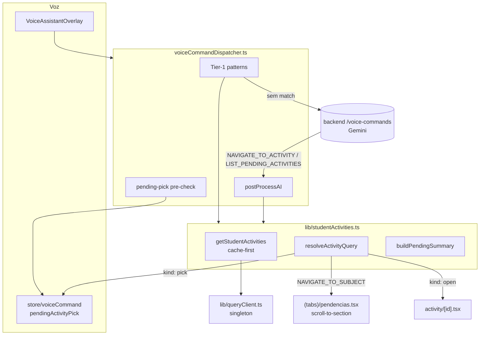

# Voice Activity Navigation — Design

**Spec**: `.specs/features/voice-activity-navigation/spec.md`
**Status**: Draft

## Architecture Overview

A feature toca quatro camadas. **O cliente é dono da resolução** (instantânea,
sobre dados já em cache); o backend de IA só **reconhece a intenção**.

1. **Fonte de dados** — `queryClient` é extraído para um módulo compartilhado
   para que o dispatcher (fora da árvore React) leia a cache
   `['student-activity-statuses']`.
2. **Resolver** — `lib/studentActivities.ts` concentra: obter as atividades
   (cache-first), casar um nome falado contra matéria/título, e montar o resumo
   falado. Usado por Tier-1 **e** Tier-2.
3. **Dispatcher** — `voiceCommandDispatcher.ts` ganha padrões Tier-1 para
   atividade/listar, um pre-check de escolha pendente, e casos de `postProcessAI`
   para os comandos vindos da IA.
4. **Tela / Voz** — `pendencias.tsx` completa o scroll-to-section; o store de voz
   ganha `pendingActivityPick`.



**Decisão-chave (resolução no dispatcher, não na tela)**: o padrão atual
`lastCommand` + `useEffect` só dispara na tela **montada**. Navegar para
atividade precisa funcionar de qualquer aba — então o dispatcher resolve e chama
`router.push('/activity/<id>')` diretamente. Só `NAVIGATE_TO_SUBJECT` continua
roteando pela tela (o alvo do scroll só existe em Pendências): o dispatcher
empurra `/pendencias` e o `lastCommand` persistente faz o efeito da tela rolar.

**Decisão-chave (desambiguação reusa `CONFIRM`)**: ao ler uma lista de
candidatas, a resposta tem `type: 'CONFIRM'`. O overlay de voz já volta a
escutar para respostas `CONFIRM` — reusamos esse mecanismo em vez de criar um
novo estado de UI.

## Code Reuse Analysis

### Componentes e utilitários existentes a reutilizar

| Item | Localização | Uso |
|---|---|---|
| `StudentActivityStatus` (tipo) | `types/pending.ts` | Forma dos dados resolvidos (`activityId`, `activityTitle`, `subjectId`, `subjectName`, `attemptStatus`, …) |
| `useStudentActivityStatuses` | `hooks/useStudentActivityStatuses.ts` | queryKey `['student-activity-statuses']`, endpoint `GET /activities/my-status` — fonte da cache |
| `apiFetch` | `lib/api.ts` | Fallback de busca quando a cache está vazia |
| `normalizeStr` | `lib/normalize.ts` | Casamento fuzzy de nomes (remove acentos, lowercase) |
| `speak` | `lib/tts.ts` | Feedback falado de toda navegação |
| `pendingConfirmAction` (padrão) | `store/voiceCommand.ts` | Molde para `pendingActivityPick` |
| `LOCAL_PATTERNS` | `lib/voiceCommandDispatcher.ts` | Lista onde entram os novos padrões Tier-1 |
| `postProcessAI` | `lib/voiceCommandDispatcher.ts` | Onde entram os casos `NAVIGATE_TO_ACTIVITY` / `LIST_PENDING_ACTIVITIES` |
| `landingRouteForRole` | `lib/routes.ts` | Reaproveitado para a correção de "turma" do aluno |
| `NAVIGATE_TO_CLASSROOM_AND_INVITE` lookup | `ProcessVoiceCommandCommandHandler.cs` | Molde de como o handler retorna comandos (sem precisar de lookup aqui) |

### Patterns existentes a seguir

| Pattern | Onde está | Aplicar em |
|---|---|---|
| Padrão `{ pattern, handler }` no `LOCAL_PATTERNS` | `voiceCommandDispatcher.ts` | Novos padrões de atividade/listar |
| Handler async retornando `Promise<VoiceCommandResponse>` | dispatcher (já suportado pela assinatura) | Resolver assíncrono (cache-miss) |
| `useOnboardingStore.getState().role ?? useAuthStore.getState().role` | dispatcher (handlers de `GO_HOME`) | Correção de "turma" por papel |
| `lastCommand` + `useEffect` na tela | `pendencias.tsx` (handler atual de `NAVIGATE_TO_SUBJECT`) | Completar com scroll |
| `ScrollView` `ref` + `onLayout` por seção | `design.md` do refactor anterior (previsto, não feito) | `pendencias.tsx` |
| Vocabulário de comandos no prompt | `VoiceCommandPromptBuilder.cs` | Novo `NAVIGATE_TO_ACTIVITY` |

### Pontos de integração

| Sistema | Método |
|---|---|
| `GET /activities/my-status` | Já existe — fonte de dados (sem mudança no endpoint) |
| `POST /voice-commands` | Já existe — ganha novo comando no vocabulário e contexto |
| Expo Router | `router.push('/(app)/activity/<id>')`, `router.push('/(app)/(tabs)/pendencias')` |
| React Query cache | `queryClient.getQueryData` / `setQueryData` / `fetchQuery` |

## Components

### `lib/queryClient.ts` (novo)

- **Propósito**: expor o `QueryClient` como singleton importável fora da árvore
  React (o dispatcher não é um componente).
- **Interface**:
  ```ts
  import { QueryClient } from '@tanstack/react-query';
  export const queryClient = new QueryClient();
  ```
- **Dependências**: nenhuma. `app/_layout.tsx` passa a importar daqui.

### `lib/studentActivities.ts` (novo)

- **Propósito**: resolver, em um só lugar, nome falado → atividade, e montar o
  resumo falado. Função pura + um wrapper assíncrono de obtenção de dados.
- **Interface**:
  ```ts
  type ActivityResolution =
    | { kind: 'open'; activity: StudentActivityStatus }
    | { kind: 'pick'; subjectName?: string;
        candidates: { activityId: string; activityTitle: string }[] }
    | { kind: 'none' };

  // cache-first; busca e semeia a cache se vazia
  export function getStudentActivities(token: string): Promise<StudentActivityStatus[]>;

  // disponível = attemptStatus null | 'InProgress'
  export function resolveActivityQuery(
    name: string, activities: StudentActivityStatus[]
  ): ActivityResolution;

  export function buildPendingSummary(
    activities: StudentActivityStatus[], subjectFilter?: string
  ): string;
  ```
- **Lógica de `resolveActivityQuery`** (ordem):
  1. Casamento por **título** (`normalizeStr`, contains nos dois sentidos).
     1 match → `open`; >1 → `pick`.
  2. Senão, casamento por **matéria**. Filtra as atividades disponíveis daquela
     matéria: 1 → `open`; >1 → `pick { subjectName, candidates }`; 0 disponíveis
     mas há atividades → `pick` com todas (status mencionado no resumo).
  3. Senão → `none`.
- **`buildPendingSummary`**: agrupa por `subjectName`; frase natural em pt-BR;
  respeita `subjectFilter`; mensagem de lista vazia.
- **Reusa**: `normalizeStr`, `apiFetch`, `queryClient`, tipo `StudentActivityStatus`.

### `store/voiceCommand.ts` (editar)

- **Mudança**: adicionar ao estado
  `pendingActivityPick: { activityId: string; activityTitle: string }[] | null`
  (init `null`), o setter `setPendingActivityPick`, e incluir o campo no `reset()`.
- **Reusa**: molde idêntico ao `pendingConfirmAction` já existente.

### `lib/voiceCommandDispatcher.ts` (editar)

- **Pre-check de escolha pendente** (no topo de `tryLocalDispatch`): se
  `pendingActivityPick` está setado, casar o transcript contra os títulos das
  candidatas (fuzzy via `normalizeStr`) e ordinais ("a primeira"/"primeira"/"a
  segunda"…); "cancelar" limpa. Match → `router.push('/activity/<id>')` + limpar.
  Sem match → limpar `pendingActivityPick` e **cair fora** (segue o dispatch
  normal) — nunca prende o aluno.
- **Novos padrões Tier-1** (antes dos padrões genéricos de `matéria`/`turma`):
  - `atividade de <X>` / `atividade <título>` — handler **async**:
    `await getStudentActivities(token)` → `resolveActivityQuery` →
    - `open` → `router.push('/activity/<id>')`, `speak("Abrindo <título>.")`
    - `pick` → setar `pendingActivityPick`, retornar
      `{ type: 'CONFIRM', command: 'PICK_ACTIVITY', speak: <lista> }`
    - `none` → `{ type: 'UNKNOWN', speak: "Não encontrei a atividade <X>." }`
  - `listar|liste|lista (as )?pendências|atividades pendentes( de <X>)?` →
    `router.push('/(app)/(tabs)/pendencias')` + `speak(buildPendingSummary(...))`.
- **`postProcessAI`** — novos casos:
  - `NAVIGATE_TO_ACTIVITY` → mesma resolução (`resolveActivityQuery` sobre
    `payload.name`); delega `pick` ao mecanismo de `pendingActivityPick`.
  - `LIST_PENDING_ACTIVITIES` → push `/pendencias` + `speak(buildPendingSummary)`,
    honrando `payload.subjectName`.
- **Correção `NAVIGATE_TO_SUBJECT`** (handler Tier-1 existente): além de emitir o
  comando, fazer `router.push('/(app)/(tabs)/pendencias')` para a tela montar e
  o efeito rolar.
- **Correção `NAVIGATE_TO_CLASSROOM`** (handler Tier-1 existente): ler o papel
  (`useOnboardingStore`/`useAuthStore`); se `student`, `router.push('/(app)/(tabs)/pendencias')`
  e `speak` neutro; se professor, comportamento atual preservado.
- **Reusa**: `getStudentActivities`, `resolveActivityQuery`, `buildPendingSummary`,
  `normalizeStr`, `speak`, stores.

### `app/(app)/(tabs)/pendencias.tsx` (editar)

- **Mudança**: completar o scroll-to-section previsto no refactor anterior.
  - `ScrollView` ganha `ref`; cada `View` de seção de matéria captura, via
    `onLayout`, o offset `y` em um `useRef<Record<subjectId, number>>`.
  - No ramo `NAVIGATE_TO_SUBJECT` do `useEffect([lastCommand])` existente: casar
    a matéria, `scrollViewRef.current?.scrollTo({ y, animated: true })`,
    `speak("Mostrando <subject>.")` e `AccessibilityInfo.announceForAccessibility`.
  - Se o offset ainda não foi capturado (dados carregando), reexecutar o scroll
    quando os dados/offsets estiverem prontos.
- **Reusa**: o `useEffect([lastCommand])` e o `grouped` Map já existentes;
  `normalizeStr`, `speak`.

### `VoiceCommandPromptBuilder.cs` (editar)

- **Mudança**: adicionar ao vocabulário de ações `NAVIGATE_TO_ACTIVITY` —
  parâmetro `name` (título da atividade ou matéria falada); instruir o modelo a
  retornar **apenas** o nome ouvido (o cliente resolve). Documentar o parâmetro
  opcional `subjectName` em `LIST_PENDING_ACTIVITIES`.

### `ProcessVoiceCommandCommandHandler.cs` (editar)

- **Mudança**: em `BuildUserContextAsync` (ramo do aluno), incluir os **títulos**
  das atividades pendentes agrupados por matéria (hoje só contagens). Limitar a
  ~20 títulos para conter o tamanho do prompt. Melhora a extração do nome pela IA.

## Error Handling Strategy

| Cenário | Tratamento | O que o aluno ouve |
|---|---|---|
| Nome não casa nada | resolver retorna `none` | "Não encontrei a atividade \<X\>." |
| Matéria/título ambíguos | resolver retorna `pick` → `CONFIRM` | A lista das candidatas + "Diga o título." |
| Escolha pendente não casa | limpa `pendingActivityPick`, segue dispatch | (a fala é processada como comando normal) |
| Cache vazia | `getStudentActivities` busca via `apiFetch` | (transparente) |
| Offline + cache vazia | erro do `apiFetch` capturado | "Não consegui carregar suas atividades." |
| Sem atividades | `buildPendingSummary` vazio | "Você não tem atividades pendentes[ em X]." |
| Matéria não está na lista (`NAVIGATE_TO_SUBJECT`) | handler não rola, fala erro | "Não encontrei a matéria \<X\>." |
| Token ausente (sessão não hidratada) | dispatcher já trata antes do Tier-2 | "Não entendi. Pode repetir?" |

## Tech Decisions

| Decisão | Escolha | Razão |
|---|---|---|
| Onde resolver atividade | Cliente, sobre a cache `['student-activity-statuses']` | Instantâneo, sem rede; o dado já está no device |
| Papel do backend de IA | Só reconhecer intenção (`NAVIGATE_TO_ACTIVITY` com `name`) | Sem lookup server-side, sem endpoint novo; resolver único no cliente |
| Quem navega para atividade | O dispatcher (`router.push` direto) | `lastCommand`+`useEffect` só dispara na tela montada; precisa funcionar de qualquer aba |
| `NAVIGATE_TO_SUBJECT` | Dispatcher empurra `/pendencias`; a tela rola | O alvo do scroll só existe em Pendências |
| Desambiguação | `type: 'CONFIRM'` + `pendingActivityPick` | Reusa o re-escutar do overlay; sem UI nova |
| Multi-match | Ler a lista e aguardar (decisão do usuário) | Evita abrir a atividade errada |
| `queryClient` | Extrair para módulo compartilhado | O dispatcher (não-componente) precisa ler a cache |
| Comando de "turma" do aluno | Resolver para Pendências | A tela de turma do aluno foi removida no refactor anterior |
