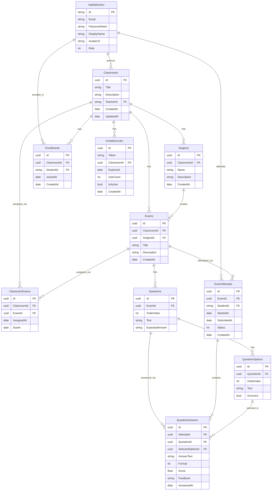

# Dillo — Plataforma Educacional com Assistente de Voz

## Descrição do projeto

**Dillo** é uma plataforma educacional mobile criada para aproximar professores e alunos em um ambiente virtual acessível, inclusivo e interativo. Seu principal objetivo é construir uma ponte entre diferentes perfis de estudantes — incluindo alunos com deficiência sensorial ou limitações de interação — e a prática pedagógica do professor, garantindo que todos possam participar do processo de aprendizagem de forma mais igualitária e autônoma.

A plataforma permite que professores criem turmas, organizem matérias e publiquem atividades e avaliações com questões objetivas ou dissertativas, enquanto os alunos acompanham seu desempenho em tempo real diretamente pelo aplicativo. Como diferencial, o Dillo integra o assistente de voz “Hey Dillo”, uma solução baseada em IA que interpreta comandos em português, navega pelas telas automaticamente e responde em voz alta, reduzindo a dependência do toque na tela. Essa abordagem amplia significativamente a acessibilidade para pessoas com deficiência visual, baixa visão ou mobilidade reduzida, além de oferecer mais praticidade em contextos educacionais dinâmicos.

O Dillo propõe uma experiência educacional centrada na inclusão, na comunicação e na aproximação entre aluno e professor, utilizando tecnologia para tornar o aprendizado mais acessível, humano e conectado às necessidades reais dos usuários.

---

## Tecnologias utilizadas e suas versões

### Mobile

| Tecnologia              | Versão   |
| ----------------------- | -------- |
| React Native            | 0.81.5   |
| Expo                    | 54.0.34  |
| Expo Router             | 6.0.23   |
| TypeScript              | 5.9.x    |
| Zustand                 | 5.0.13   |
| TanStack Query          | 5.100.10 |
| Tamagui                 | 1.144.4  |
| NativeWind              | 4.2.3    |
| expo-speech-recognition | 3.1.3    |
| expo-speech             | 14.0.8   |
| React                   | 19.1.0   |

### Backend

| Tecnologia                  | Versão  |
| --------------------------- | ------- |
| .NET / ASP.NET Core         | 10.0    |
| Entity Framework Core       | 10.0.8  |
| Npgsql (EF Core PostgreSQL) | 10.0.1  |
| MediatR                     | 14.1.0  |
| ASP.NET Core Identity       | 10.0.8  |
| JWT Bearer Authentication   | 10.0.8  |
| Google.Apis.Auth            | 1.74.0  |
| Scalar (OpenAPI UI)         | 2.14.14 |

### Banco de dados e infraestrutura

| Tecnologia      | Versão          |
| --------------- | --------------- |
| PostgreSQL      | 17 (via Docker) |
| Docker Compose  | —               |
| pnpm workspaces | 9+              |

### Inteligência Artificial

| Tecnologia        | Detalhe                            |
| ----------------- | ---------------------------------- |
| Google Gemini API | Modelo `gemini-2.0-flash` via REST |

---

## Abordagens e metodologias utilizadas

### Backend — Vertical Slice Architecture + CQRS

Cada funcionalidade é isolada em uma fatia vertical independente dentro de `Features/<NomeDaFeature>/`. Não há camadas horizontais compartilhadas entre features. Cada fatia contém seus próprios `Commands/`, `Queries/`, `DTOs/` e contratos de exceção.

O padrão **CQRS** é implementado com **MediatR**: operações de escrita são `IRequest<T>` despachados por `IRequestHandler`, e leituras seguem o mesmo contrato. Os endpoints são registrados automaticamente via a interface `IEndpoint` — qualquer classe que implemente a interface é descoberta e mapeada sem configuração manual.

### Mobile — Roteamento por arquivo e estado global reativo

A navegação usa **Expo Router** com convenção de arquivos: o grupo `(auth)/` contém telas públicas e `(app)/` protege as telas autenticadas via guard no `_layout.tsx`, que lê o estado de autenticação diretamente do store Zustand.

O estado do servidor é gerenciado com **TanStack Query** (cache, revalidação e sincronização). O estado de autenticação (userId, token, isSignedIn) vive no **Zustand** com persistência via `expo-secure-store`.

### Assistente de Voz — Processamento de linguagem natural via Gemini

O fluxo de voz funciona em três etapas no cliente: (1) `expo-speech-recognition` captura o áudio e gera o transcript; (2) o transcript é enviado junto com o contexto da tela atual ao endpoint `POST /voice-commands`; (3) o backend consulta o Gemini com um prompt estruturado que inclui papel do usuário e dados do contexto, e retorna uma ação tipada (`NAVIGATE_TO_CLASSROOMS`, `CREATE_CLASSROOM`, etc.) com feedback em português falado via `expo-speech`.

### Autenticação

Suporte a dois fluxos: **email/senha** com hash gerenciado pelo ASP.NET Core Identity, e **Google OAuth** via token de ID do cliente mobile validado pelo `Google.Apis.Auth`. Em ambos os casos a resposta é um **JWT** assinado com HMAC-SHA256, válido por 7 dias.

### Testes 
Para garantir a confiabilidade, a estabilidade e a segurança da plataforma, o projeto conta com uma suíte de testes automatizados robusta. A cobertura de testes foi desenhada seguindo a lógica das fatias verticais do sistema, isolando e validando desde os fluxos mais críticos de identidade até as regras de negócio complexas que envolvem a execução e correção de avaliações.
| Funcionalidade | Testes |
|---------|-------|
| Auth (Login, Register, DeleteAccount, RestoreAccount, SetRole) | 29 |
| Classrooms (Create, GetMy, GetById) | 9 |
| Invitations (Generate, Join) | 13 |
| Exams (Create + all validation paths) | 10 |
| ExamAttempts (Start, Submit, Grade) | 26 |
| **Total** | **87** |
---

## Como executar o projeto

### Pré-requisitos

- Node.js 20+ e pnpm 9+
- .NET SDK 10
- Docker e Docker Compose

### 1. Clonar e instalar dependências

```bash
git clone <url>
cd Hacakthon-Unirios-2026
pnpm install
```

### 2. Backend

#### Opção A — Docker Compose (recomendado)

Crie um arquivo `.env` na raiz do repositório:

```env
JWT_SIGNING_KEY=troque-por-uma-chave-segura-com-32-chars-minimo

# Opcional — padrão: postgres
POSTGRES_PASSWORD=postgres

# URL pública da API (substitua localhost pelo IP da máquina para dispositivos físicos)
APP_BASE_URL=http://localhost:5099

# Scheme do deep link do app mobile
APP_MOBILE_SCHEME=hackathon-app

# Necessário para o assistente de voz
GEMINI_API_KEY=

# Necessário para login com Google
GOOGLE_WEB_CLIENT_ID=
GOOGLE_ANDROID_CLIENT_ID=
```
> [!IMPORTANT]
> Para que o assistente de voz "Hey Dillo" funcione corretamente, você precisa obter uma chave de API gratuita do Google Gemini e adicioná-la às suas variáveis de ambiente.
> 1. Acesse o console do Google AI Studio.
> 2. Faça login com a sua conta Google.
> 3. No menu lateral ou no topo da página, clique no botão "Get API key" (Obter chave de API).
> 4. Clique em "Create API key" (Criar chave de API).
> 5. Se solicitado, selecione ou crie um projeto do Google Cloud para associar à chave.
> 6. Copie a chave gerada (ela começará com algo como AIzaSy...) e cole em seu `.env` no campo `GEMINI_API_KEY=`.

```bash
docker-compose up -d
```

O compose sobe o banco PostgreSQL (porta `5433` no host) e a API (porta `5099`). As migrations são aplicadas automaticamente na inicialização.

> Para testar com dispositivo físico, substitua `localhost` pelo IP local da máquina:
>
> ```bash
> # Linux
> ip route get 1 | awk '{print $7}'
> # macOS
> ipconfig getifaddr en0
> ```

#### Opção B — .NET local

Requer PostgreSQL rodando localmente. O arquivo `apps/backend/src/HackathonUnirios2026.API/appsettings.Development.json` já contém valores padrão para desenvolvimento.

```bash
cd apps/backend
dotnet dotnet-ef database update \
  --project src/HackathonUnirios2026.Infra \
  --startup-project src/HackathonUnirios2026.API
dotnet run --project src/HackathonUnirios2026.API
```

A API fica disponível em `http://localhost:5099`. A documentação interativa está em `http://localhost:5099/scalar`.

### 3. Mobile

```bash
cp apps/mobile/.env.example apps/mobile/.env
```

Edite `apps/mobile/.env`:

```env
EXPO_PUBLIC_API_URL=http://localhost:5099
# No Android Emulator, use: http://10.0.2.2:5099

EXPO_PUBLIC_GOOGLE_WEB_CLIENT_ID=
EXPO_PUBLIC_GOOGLE_ANDROID_CLIENT_ID=
EXPO_PUBLIC_GOOGLE_REDIRECT_URI=
```

```bash
pnpm mobile          # Expo dev server
pnpm mobile:android  # Android
pnpm mobile:web      # Web
```

---

## Diagrama do modelo lógico do banco de dados


